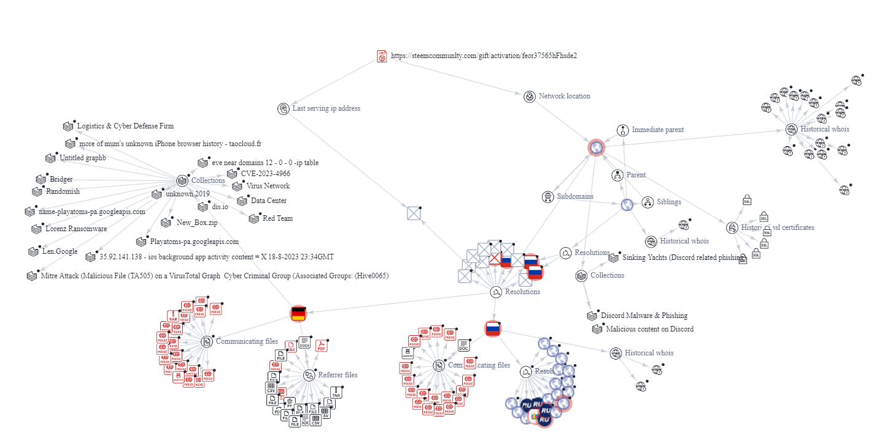

An example of typosquatting found in the wild! I came across this malicious link courtesy of a hacked account on the gaming platform, Steam. I was informed that someone had purchased a gift for me, and I should click the link shown in the diagram to claim it. Lucky me. It appears the attacker is meant to exploit the victim in two ways: First, the attack vector is a hacked account of one of your Steam friends. This is meant to exploit your trust since you think the message is coming from one of your friends that you deliberately added. Second, the attacker is counting on the victim being too hasty to notice that the URL says “steemcommunlty” instead of “steamcommunity”. Needless to say, this link is very malicious. But I still wanted to run it through VirusTotal to understand what was going on.

Almost immediately, over 10 of the cyber security vendors in VirusTotal’s polling claim the link is malicious. Opening the graph gives an interesting perspective. The URL points to a domain that is loaded with a trojan and linked to other malicious domains. Moreover, we have several foreign, unauthorized IP addresses that are ready to collect any information that is stolen. Each of these IP addresses has a ton of tools loaded for information extraction and are associated with many malicious websites.

I have seen this attack in action firsthand and can say its purpose is to gain access to your Steam account. Once they have access, they look through your friends list and message anyone of interest with the same pitch as before, claiming that they bought the victim a gift. It is quite an effective system as the attacker can take what they want from the compromised account and have a whole selection of targets to choose from afterwards.

  

